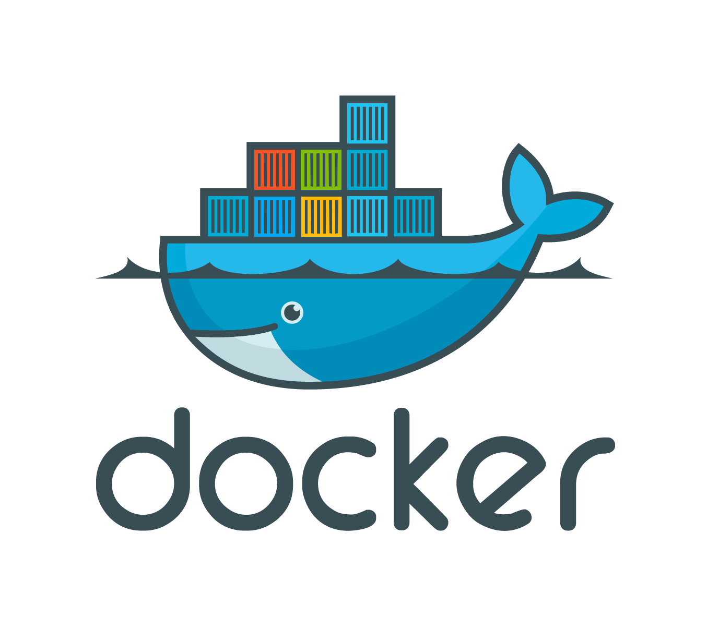

class: center, middle

# My Awesome Presentation

???

Notes for the _first_ slide!

---

# Agenda

1. Introduction
2. Deep-dive
3. ...

[NOTE]: Note that you need remark.js alongside this html file, but no internet connection.
---

# Introduction

--

* Bullet 1

--

* Bullet 2

--

* Bullet 3

---

## Install Docker

- Install the Containers feature

- Install and start the Docker service

.exercise[
- Install Docker and feature with Microsoft's package:
  ```powershell
  Install-Module -Name DockerMsftProvider -Repository PSGallery -Force
  Install-Package -Name docker -ProviderName DockerMsftProvider
  Restart-Computer -Force
  ```
]

.warning[
  Just a warning sign!
]

---

background-image: url(images/docker-windows.png)

## Docker Windows whale

---

## Docker Windows whale


